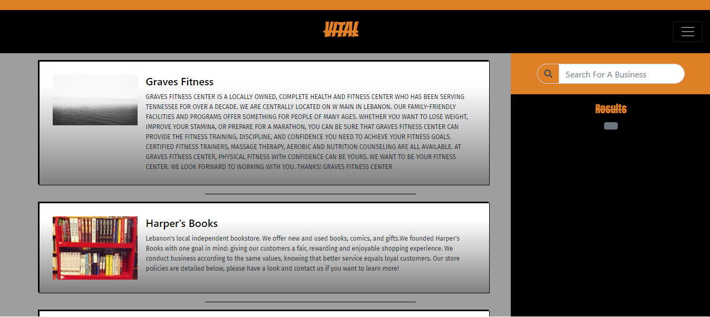

# Vital
Local business social discovery app built with the MERN Stack. This is an app that allows users to view local businesses within 30 miles of where they 
are currently located. It is designed with the idea of spreading local businesses across the web. Small Business owner have the capabilty to create a business account so users can be made aware of there business.




<!-- {width=200px height=250px} -->

## Getting Started

To Get started do the NPM INSTALL command in the root directory once you have cloned the project to your local machine.
Then run an NPM START in the src directory to start the React App.

### Prerequisites

You need JavaScript Installed as well as NodeJS and MongoDB to run this application on your local machine.

### Installing

A step by step series of examples that tell you how to get a development env running

Clone The Repository to your machine in your command line

```
Git Clone <Github Url>
```

Install the dependencies from the root directory

```
npm i 

```
Start the react app from the src directory in the client folder
```
npm start

```

## Built With

* [React]- Used for building components and rendering elements
* [Express] - Framework used with NodeJS
* [MongoDB] - Database Used
* [Bootstrap] - StyleSheet Library
* [BingMaps] - Used for making GeoSpatial calculations
* [NodeJs] - Backend Enviroment
* [Passport] - Used for User-Authentication
* [Axios] - Used to make api calls
* [Mongoose] - MongoDB framework


## Versioning

* Vol 1 

## Authors

* **Lazontez Gardner** - *Initial work* - [Lazontez](https://github.com/Lazontez)

See also the list of [contributors](https://github.com/Lazontez/Hermes/contributors) who participated in this project.

## License

This project is licensed under the MIT License - see the [LICENSE.md](LICENSE.md) file for details

## Acknowledgments

* Small businesses are essential to buiding a good community

